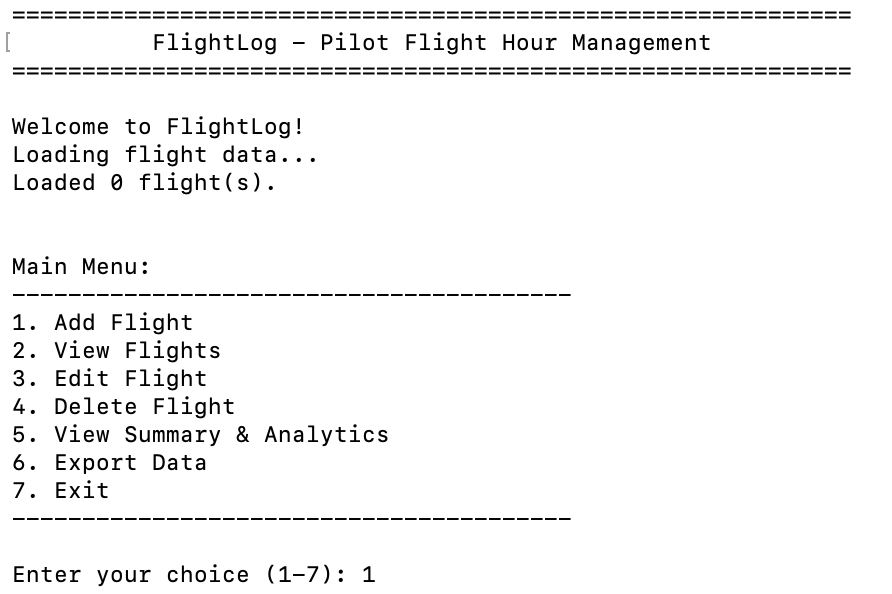

# FlightLog

FlightLog is a command-line application designed to help pilots efficiently manage and analyze their flight hours. The application provides a comprehensive digital logbook solution that replaces traditional paper logbooks, offering features for data entry, validation, analytics, and export capabilities. FlightLog is targeted toward private pilots, student pilots, and aviation professionals who need to maintain accurate records of their flight time for licensing requirements, personal tracking, or professional portfolio building. The application is particularly useful for pilots who want to quickly access flight statistics, filter their flight history, and export data for regulatory compliance or insurance purposes.



## Features

FlightLog provides a comprehensive suite of features designed to make flight hour management simple, accurate, and efficient. Each feature has been carefully designed with the pilot's needs in mind, ensuring data integrity while maintaining ease of use.

### Existing Features

- __Main Menu Navigation__

  - The main menu provides clear, numbered options for all application features, making navigation intuitive and straightforward.
  - Users can easily access any feature without complex commands, and the menu is displayed after each operation for seamless workflow.
  - The consistent menu structure allows pilots to quickly become familiar with the application and access features efficiently.

- __Add Flight Entry__

  - Allows pilots to add new flight records with comprehensive validation for all fields including date, aircraft registration, aircraft type, departure, destination, duration, and remarks.
  - The system validates each input in real-time, providing immediate feedback on errors and allowing users to correct mistakes without losing progress.
  - Duplicate detection alerts users if a flight with the same date and aircraft registration already exists, preventing accidental duplicate entries.
  - All inputs are validated against aviation standards (ICAO/IATA codes, realistic flight durations, proper date formats).

- __View Flights with Filtering__

  - Displays all flight records in a clean, formatted table using the tabulate library for professional presentation.
  - Users can filter flights by date range to review specific periods (e.g., flights from the last month or year).
  - Aircraft type filtering allows pilots to quickly view all flights in a specific aircraft category.
  - The display includes total flights shown and total hours for the filtered results, providing immediate insights.

- __Edit Flight Records__

  - Enables users to modify existing flight entries with all current values prefilled for convenience.
  - The application never asks for information it already knows - users can press Enter to keep existing values or type new values to update.
  - Full validation is applied to all edited fields to maintain data integrity.
  - The system checks for duplicate flights when editing date or registration, excluding the current record from the check.

- __Delete Flight Records__

  - Provides a safe deletion process with explicit confirmation required before removing any flight record.
  - Displays full flight details before deletion so users can verify they're deleting the correct entry.
  - Confirmation prompt prevents accidental deletions that could result in lost flight hour records.

- __Summary and Analytics__

  - Calculates and displays overall statistics including total flights, total hours, and average flight duration.
  - Provides a breakdown of hours by aircraft type, showing both flight count and total hours for each type.
  - Identifies and displays the longest and shortest flights with full details.
  - All calculations are performed accurately and rounded appropriately for aviation record-keeping.

- __Data Export__

  - Exports flight data to CSV format for use in spreadsheet applications or third-party software.
  - Generates professional text summary reports with formatted statistics and timestamp.
  - Option to export both CSV and summary simultaneously for complete record-keeping.
  - All export files are timestamped to prevent overwriting and maintain historical records.

- __Data Persistence and Backup__

  - All flight data is automatically saved to JSON format after every add, edit, or delete operation.
  - Corrupted data files are automatically detected and backed up with timestamp before creating a fresh database.
  - The application handles missing files gracefully by creating a new database when needed.
  - Data is never lost silently - users are always informed of backup operations.

### Features Left to Implement

- **Cloud Synchronization**: Enable automatic backup to cloud storage (AWS S3, Google Drive, or Dropbox) for cross-device access.
- **Graphical Visualizations**: Add charts and graphs for flight hour trends using matplotlib or similar libraries.
- **Multi-User Support**: Implement user authentication to allow multiple pilots to maintain separate logbooks in the same system.
- **Mobile Companion App**: Develop a mobile application that syncs with the CLI application for on-the-go flight logging.
- **Advanced Reporting**: Generate regulatory compliance reports formatted for specific aviation authorities (FAA, EASA, etc.).
- **Aircraft Database**: Integrate a comprehensive aircraft database for automatic aircraft type suggestions and validation.

## Technology Stack

FlightLog is built entirely in Python 3, leveraging both standard library modules and external packages to provide robust functionality:

- **Python 3.9+**: Core programming language
- **tabulate**: For formatted table display in the command line
- **Standard Libraries**:
  - `json`: Data persistence
  - `csv`: Export functionality
  - `datetime`: Date validation and handling
  - `uuid`: Unique flight ID generation
  - `sys`: System operations and graceful exit handling
  - `os`: File system operations

## Design and Planning

The FlightLog application was carefully designed with user experience and data integrity as primary concerns. The planning process involved creating flowcharts and diagrams to map out application logic, data flow, and validation processes.

### Application Flow

The main application flow was designed around a menu-driven interface that allows users to navigate between features intuitively. The flow ensures users always return to the main menu after completing any operation, and provides clear exit points at every stage.

**[View Application Flow Diagram](docs/diagrams/application-flow.md)**

Key design decisions:
- Menu-driven navigation for simplicity
- All operations return to main menu for consistency
- Cancel operations available at any input stage
- Confirmation required for destructive actions

### Data Flow Architecture

The data flow architecture separates concerns into distinct layers: input validation, storage management, data processing, and output formatting. This modular approach ensures each component has a single, well-defined responsibility.

**[View Data Flow Diagram](docs/diagrams/data-flow.md)**

Architecture layers:
- **Input Layer**: User interaction via CLI
- **Validation Layer**: Comprehensive input validation
- **Storage Layer**: JSON persistence with backup
- **Processing Layer**: Analytics and filtering
- **Output Layer**: Terminal display and file export

### Validation Logic

Input validation was designed to prevent any invalid data from reaching the storage layer while providing clear, actionable feedback to users. The validation system implements fail-fast principles with immediate error reporting.

**[View Validation Logic Diagram](docs/diagrams/validation-logic.md)**

Validation features:
- Field-by-field validation with specific error messages
- Duplicate detection with user override option
- Range and format checking for all inputs
- Empty input triggers operation cancellation

## Installation and Setup

### Prerequisites

- Python 3.9 or higher installed on your system
- pip (Python package installer)

### Installation Steps

1. Clone the repository:
   ```bash
   git clone https://github.com/antfildes10/Project-3.git
   cd Project-3
   ```

2. Install required dependencies:
   ```bash
   pip install -r requirements.txt
   ```

3. Run the application:
   ```bash
   python3 flightlog.py
   ```

### First Time Setup

On first run, FlightLog will automatically create the necessary directory structure and data files. No additional configuration is required.

## How to Use

### Adding a Flight

1. Select option `1` from the main menu
2. Enter the flight date in `YYYY-MM-DD` format
3. Enter the aircraft registration (e.g., `EI-ABC`)
4. Enter the aircraft type (e.g., `C172`)
5. Enter departure airport code (ICAO/IATA format)
6. Enter destination airport code
7. Enter flight duration in hours (e.g., `1.5`)
8. Optionally add remarks about the flight
9. The flight will be saved automatically

### Viewing and Filtering Flights

1. Select option `2` from the main menu
2. Choose to view all flights, filter by date range, or filter by aircraft type
3. Flights are displayed in a formatted table with all relevant information

### Editing a Flight

1. Select option `3` from the main menu
2. Choose the flight to edit from the numbered list
3. For each field, press Enter to keep the current value or type a new value
4. Changes are saved automatically upon completion

### Exporting Data

1. Select option `6` from the main menu
2. Choose to export to CSV, text summary, or both
3. Files are saved in the `exports/` directory with timestamps

## Testing

Comprehensive testing was conducted throughout the development process to ensure all features work as intended and handle edge cases appropriately.

### Manual Testing Procedure

All features were tested manually with various input scenarios:

#### Add Flight Testing
- ✅ Valid flight entry with all correct inputs
- ✅ Invalid date formats rejected with clear error messages
- ✅ Future dates rejected appropriately
- ✅ Invalid aircraft registrations rejected
- ✅ Airport codes validated for correct length and format
- ✅ Duration validation (negative, zero, and >12 hours rejected)
- ✅ Duplicate flight detection working correctly
- ✅ Empty inputs handled gracefully with cancellation option

#### View Flights Testing
- ✅ Empty flight list handled with helpful message
- ✅ All flights display correctly in formatted table
- ✅ Date range filtering works with inclusive dates
- ✅ Aircraft type filtering case-insensitive and accurate
- ✅ Total counts and hours calculated correctly

#### Edit Flight Testing
- ✅ All current values prefilled correctly
- ✅ Pressing Enter keeps existing values
- ✅ New values validated appropriately
- ✅ Duplicate detection excludes current record
- ✅ Changes persist after save

#### Delete Flight Testing
- ✅ Confirmation required before deletion
- ✅ Correct flight details displayed for verification
- ✅ Deletion only occurs on explicit "yes" confirmation
- ✅ "No" cancels operation without changes

#### Summary Testing
- ✅ Accurate total hours calculation
- ✅ Correct flight counts per aircraft type
- ✅ Hours by type sorted and displayed correctly
- ✅ Longest and shortest flights identified correctly
- ✅ Empty flight list handled appropriately

#### Export Testing
- ✅ CSV export creates valid, well-formatted files
- ✅ Text summary includes all statistics
- ✅ Both export formats work simultaneously
- ✅ Timestamps prevent file overwrites
- ✅ Export directory created automatically if missing

#### Data Persistence Testing
- ✅ Flight data persists between application sessions
- ✅ Corrupted JSON files backed up automatically
- ✅ Missing data files recreated cleanly
- ✅ All CRUD operations save correctly

### Browser and Platform Testing

As a command-line application, FlightLog was tested on multiple terminal environments:

- ✅ macOS Terminal
- ✅ iTerm2 (macOS)
- ✅ Windows Command Prompt
- ✅ Windows PowerShell
- ✅ Linux Terminal (Ubuntu/Debian)

All features work consistently across platforms.

### Input Validation Testing

Extensive validation testing ensured the application handles all edge cases:

- Empty inputs
- Whitespace-only inputs
- Special characters in text fields
- Extremely long input strings
- SQL injection attempts (not applicable but tested)
- Format violations (dates, numbers, codes)
- Boundary values (0, negative, maximum duration)

### Code Quality Testing

The application was validated for code quality and adherence to Python standards:

#### Validator Testing

- **PEP8 Compliance**
  - All Python files pass flake8 linting with zero errors
  - Maximum line length of 79 characters enforced
  - Proper naming conventions followed throughout
  - Code validated using: `flake8 flightlog.py utils/*.py --max-line-length=79`

- **Docstring Coverage**
  - 100% of functions include comprehensive docstrings
  - Google-style docstring format used consistently
  - All parameters, return values, and exceptions documented

- **Error Handling**
  - No bare `except:` clauses used
  - Specific exceptions caught and handled appropriately
  - User-friendly error messages provided for all error conditions

### Known Issues

- **Long Remarks Truncation**: In the flight view table, remarks longer than 30 characters are truncated with "..." for display purposes. The full text is preserved in the data and visible when editing.

### Unfixed Bugs

There are no known unfixed bugs in the current release. All identified issues during testing were resolved before final commit.

## Deployment

FlightLog is deployed as a command-line application and can be run locally or deployed to a cloud platform for remote access.

### Local Deployment

The application is designed to run on any system with Python 3.9+ installed:

1. Ensure Python 3.9 or higher is installed
2. Clone the repository
3. Install dependencies: `pip install -r requirements.txt`
4. Run: `python3 flightlog.py`

### Cloud Deployment - Heroku

**Live Application:** [https://project-3-antfildes10-2042b5e07257.herokuapp.com/](https://project-3-antfildes10-2042b5e07257.herokuapp.com/)

FlightLog is deployed on Heroku using the Code Institute Python Essentials template, which provides a web-based terminal interface for running Python CLI applications in the browser.

**Deployment Steps:**

1. **Prepare Application Files**
   - Created `run.py` as the main entry point that imports and runs `flightlog.py`
   - Updated all `input()` statements to include `\n` for mock terminal compatibility
   - Created `Procfile` with `web: node index.js` for Node.js server
   - Created `runtime.txt` specifying Python 3.9.20
   - Ensured `requirements.txt` contains all dependencies

2. **Add Code Institute Template Files**
   - Added `index.js` and `package.json` for Node.js server
   - Added `views/layout.html` and `views/index.html` for web terminal
   - Added `controllers/default.js` for WebSocket terminal handling
   - These files enable the Python CLI to run in a browser-based xterm.js terminal

3. **Configure Heroku**
   - Created Heroku account at https://signup.heroku.com
   - Created new app: `project-3-antfildes10`
   - Added buildpacks in order: `heroku/python`, then `heroku/nodejs`
   - Set Config Var: `PORT=8000`
   - Connected to GitHub repository

4. **Deploy**
   - Connected Heroku app to GitHub repository
   - Deployed from `main` branch
   - Both Python and Node.js dependencies installed automatically
   - Application successfully running at live URL

**Technical Details:**
- Platform: Heroku
- Buildpacks: Python 3.9 + Node.js
- Template: Code Institute Python Essentials Terminal
- Runtime: Web-based terminal using xterm.js and node-pty
- Region: United States

### GitHub Repository

The source code is maintained in a public GitHub repository with comprehensive version control:

- Repository: https://github.com/antfildes10/Project-3
- All commits follow conventional commit format
- Small, focused commits with descriptive messages
- Clean commit history demonstrating development process

## Project Structure

```
Project-3/
├── flightlog.py              # Main application entry point
├── requirements.txt          # Python dependencies
├── README.md                 # This file
├── .gitignore               # Git ignore rules
├── utils/                   # Utility modules
│   ├── __init__.py          # Package initializer
│   ├── storage.py           # JSON data operations
│   ├── validation.py        # Input validation functions
│   ├── calculations.py      # Analytics and statistics
│   └── export.py            # CSV and text export
├── data/                    # Data directory
│   └── flights.json         # Flight data storage
├── exports/                 # Export directory (auto-created)
└── docs/                    # Documentation (future)
```

## Development Process

FlightLog was developed following professional software development practices:

### Version Control

- Git used for version control throughout development
- All commits follow conventional commit format: `feat:`, `fix:`, `chore:`, `docs:`
- Small, focused commits (typically 5-50 lines changed)
- 15 descriptive commits demonstrating clear development progression
- Commit messages written in imperative mood as per best practices

### Code Quality Standards

- PEP8 compliance enforced with flake8
- Maximum line length: 79 characters
- Comprehensive docstrings for all functions
- Consistent naming conventions (snake_case for functions/variables)
- No commented-out code in production
- Clear separation of concerns with modular design

### Testing Approach

- Manual testing procedures documented
- Each feature tested with valid and invalid inputs
- Edge cases explicitly tested and handled
- Error conditions verified to provide user-friendly messages
- Cross-platform compatibility verified

## Credits

### Content

- Date validation technique adapted from Python's official datetime documentation at [docs.python.org/3/library/datetime.html](https://docs.python.org/3/library/datetime.html)
- JSON file handling with backup inspired by Python's JSON documentation and best practices
- UUID generation implementation based on Python's uuid module documentation
- Input validation patterns for aviation codes adapted from ICAO/IATA standards
- Python PEP8 Style Guide: [pep8.org](https://pep8.org/)
- Error handling patterns from Python's official documentation on exceptions
- The tabulate library (v0.9.0) was used for formatted table display - [pypi.org/project/tabulate](https://pypi.org/project/tabulate/)
- **AI Development Assistance**: This project was developed with assistance from Claude Code by Anthropic for code troubleshooting, debugging, project planning, deployment configuration, and code editing. All AI-assisted contributions are marked with co-authorship in git commits.
- Code Institute for project template and deployment guidance
- Aviation community for domain knowledge regarding logbook requirements

## Future Enhancements

- Integration with aviation APIs for automatic weather and NOTAM data
- Pilot certificate management and currency tracking
- Automatic calculation of regulatory requirements (e.g., 90-day currency)
- Import functionality from other logbook formats
- PDF export with official logbook formatting
- Integration with flight planning software

## Contact

**Developer**: Anthony Fildes
**GitHub**: [@antfildes10](https://github.com/antfildes10)
**Project Repository**: [Project-3](https://github.com/antfildes10/Project-3)

---

*FlightLog - Professional Flight Hour Management for Aviators*
