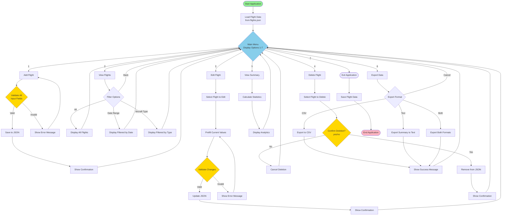

# FlightLog Application Flow

This diagram shows the main navigation flow and user interaction paths through the FlightLog application.

## Key Navigation Paths

1. **Add Flight Path**: Input validation → Save → Confirmation → Return to menu
2. **View Flight Path**: Select filter → Display results → Return to menu
3. **Edit Flight Path**: Select flight → Prefill values → Validate → Save → Return to menu
4. **Delete Flight Path**: Select flight → Confirm deletion → Delete/Cancel → Return to menu
5. **Summary Path**: Calculate statistics → Display → Return to menu
6. **Export Path**: Select format → Export → Confirmation → Return to menu
7. **Exit Path**: Save data → Exit application

## User Control Features

- All operations return to main menu after completion
- Invalid input prompts user to retry (never crashes)
- Confirmation required for destructive actions (delete)
- Clear error messages guide user to correct input
- User can cancel operations at any point
