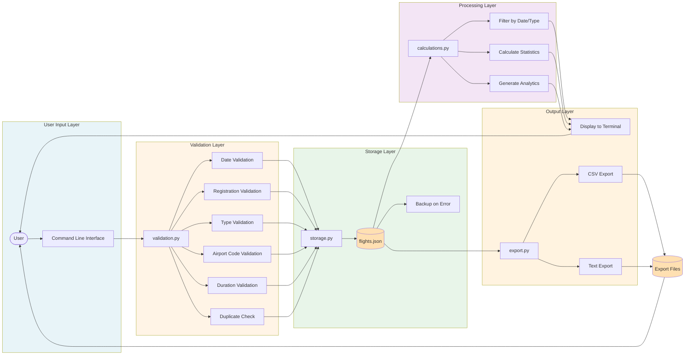

# FlightLog Data Flow Diagram

This diagram illustrates how flight data flows through the FlightLog system, from user input through validation, storage, processing, and output.



## Data Flow Description

### 1. Input Layer
- User interacts with command-line interface
- Requests are routed to appropriate functions in `flightlog.py`

### 2. Validation Layer (`utils/validation.py`)
All user input is validated before storage:
- **Date Validation**: YYYY-MM-DD format, not in future
- **Registration Validation**: 2-10 characters, alphanumeric + hyphen
- **Type Validation**: Non-empty string
- **Airport Code Validation**: 3-4 characters, uppercase
- **Duration Validation**: Positive number, max 12 hours
- **Duplicate Check**: Prevents duplicate (date, registration) pairs

### 3. Storage Layer (`utils/storage.py`)
- Valid data stored in `data/flights.json`
- JSON format with UTF-8 encoding
- Backup created if corruption detected
- CRUD operations:
  - **Create**: Add new flight to JSON array
  - **Read**: Load flights from JSON
  - **Update**: Modify existing flight in array
  - **Delete**: Remove flight from array

### 4. Processing Layer (`utils/calculations.py`)
Flight data is processed for analytics:
- **Filtering**: By date range or aircraft type
- **Statistics**: Total flights, total hours, averages
- **Analytics**: Hours by aircraft type, longest/shortest flights

### 5. Output Layer
Processed data delivered to user:
- **Terminal Display**: Formatted tables using tabulate library
- **CSV Export**: Machine-readable format for spreadsheets
- **Text Export**: Human-readable summary reports

## Data Model

Each flight record contains:
```python
{
    "id": "uuid4-string",              # Unique identifier
    "date": "YYYY-MM-DD",               # Flight date
    "aircraft_reg": "EI-ABC",           # Aircraft registration
    "aircraft_type": "C172",            # Aircraft type
    "departure": "EIDW",                # Departure airport (ICAO/IATA)
    "destination": "EICK",              # Destination airport
    "duration_hours": 1.5,              # Flight duration (decimal)
    "remarks": "Training flight"        # Optional notes
}
```

## Error Handling

- **Validation Errors**: User prompted to retry with clear error messages
- **Storage Errors**: JSON corruption triggers backup and initialization
- **Permission Errors**: Graceful handling with user-friendly messages
- **Format Errors**: Invalid JSON replaced with empty array and backup created

## Data Integrity

- UUID ensures unique identification of each flight
- Validation prevents invalid data from entering storage
- Duplicate detection prevents accidental re-entry
- Backup mechanism protects against data corruption
- All file operations include error handling
