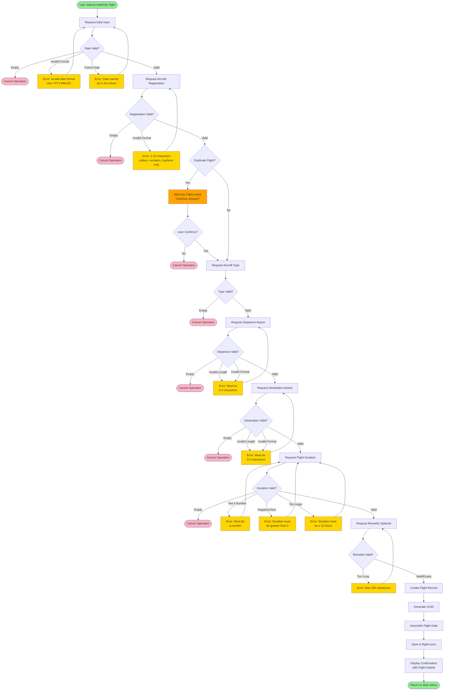

# FlightLog Validation Logic

This diagram shows the detailed validation sequence for adding or editing a flight record. Every input field undergoes comprehensive validation before being accepted.

## Validation Rules

### 1. Date Validation
- **Format**: Must be YYYY-MM-DD
- **Range**: Cannot be in the future
- **Required**: Yes (empty cancels operation)
- **Implementation**: `validation.validate_date()`

### 2. Aircraft Registration Validation
- **Length**: 2-10 characters
- **Characters**: Alphanumeric and hyphens only
- **Case**: Converted to uppercase
- **Required**: Yes
- **Implementation**: `validation.validate_aircraft_reg()`

### 3. Duplicate Flight Check
- **Check**: (date + aircraft_reg) combination
- **Action**: Warns user, allows override
- **Purpose**: Prevent accidental duplicate entries
- **Implementation**: `validation.check_duplicate_flight()`

### 4. Aircraft Type Validation
- **Length**: Must not be empty
- **Case**: Converted to uppercase
- **Required**: Yes
- **Implementation**: `validation.validate_aircraft_type()`

### 5. Airport Code Validation (Departure & Destination)
- **Length**: 3-4 characters (ICAO or IATA format)
- **Characters**: Alphanumeric only
- **Case**: Converted to uppercase
- **Required**: Yes
- **Implementation**: `validation.validate_airport_code()`

### 6. Duration Validation
- **Type**: Must be a valid number
- **Range**: > 0 and ≤ 12.0 hours
- **Format**: Decimal allowed (e.g., 1.5)
- **Required**: Yes
- **Implementation**: `validation.validate_duration()`

### 7. Remarks Validation
- **Length**: Maximum 200 characters
- **Required**: No (optional field)
- **Default**: Empty string if not provided
- **Implementation**: `validation.validate_remarks()`

## Edit Flight Special Behavior

When editing an existing flight:
1. **Prefill Values**: All current values displayed in brackets [like this]
2. **Press Enter to Keep**: User presses Enter without typing to keep current value
3. **Type to Change**: User types new value to update field
4. **Same Validation**: All new values undergo same validation as add operation
5. **Exclude Self from Duplicate Check**: When checking duplicates, excludes the flight being edited

## User Experience Features

### Error Handling
- **Clear Messages**: Each error explains exactly what's wrong
- **Immediate Feedback**: Validation happens as soon as input is provided
- **Retry Allowed**: User can immediately retry after error
- **No Data Loss**: Partial input is retained where appropriate

### Cancellation
- **Empty Input**: Pressing Enter without input cancels operation
- **Any Stage**: User can cancel at any validation stage
- **Confirmation**: Cancel message displayed
- **Return to Menu**: Safe return to main menu

### Confirmation
- **Duplicate Warning**: User must explicitly confirm duplicate entry
- **Delete Confirmation**: Explicit yes/no required for deletion
- **Success Message**: Clear confirmation after successful save
- **Details Display**: Full flight details shown after add/edit

## Data Integrity Guarantees

1. **No Invalid Data**: Only validated data reaches storage
2. **Type Safety**: All fields converted to correct types (string, float, etc.)
3. **Format Consistency**: Dates, codes, and registrations normalized to uppercase
4. **Duplicate Prevention**: Warning system prevents accidental duplicates
5. **UUID Uniqueness**: Every flight has guaranteed unique identifier

This validation system ensures **100% data integrity** while maintaining **excellent user experience** through clear feedback and error recovery.
